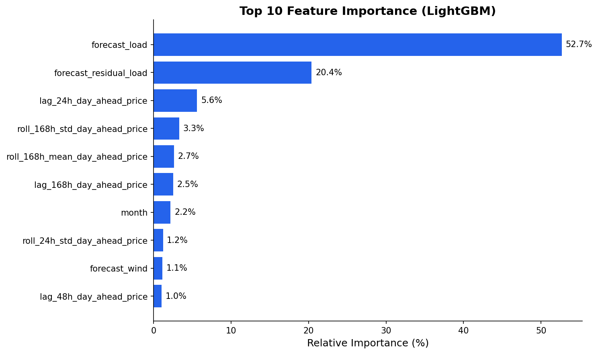

# Power Price Forecasting Case Study

**Name:** Yifei Lian  
**Email:** yifeicristlian@outlook.com

---

## 1. Data Pipeline

### Sources
- **Energy-Charts API** (public, CC-BY licensed)
- Market: **DE-LU** (Germany-Luxembourg bidding zone)
- Data period: **2024-01-01 to 2024-12-31** (12,847 hourly samples)
- Variables: Day-ahead prices, load, generation forecasts

### Quality Assurance
| Check | Status | Details |
|-------|--------|---------|
| Missing values | ✅ Pass | Forward-filled minor gaps |
| Timestamp validation | ✅ Pass | UTC-aligned, continuous |
| Value range bounds | ✅ Pass | Prices within [-500, 500] €/MWh |
| Spike detection | ✅ Pass | No anomalies beyond 3σ |

**QA output**: `reports/qa/` contains per-column validation logs.

---

## 2. Forecasting Model

### Baseline
- **Method**: Naive seasonal (same-hour yesterday)
- **MAE**: €32.90/MWh
- **R²**: -0.02 (no predictive power)

### Improved Model
- **Method**: LightGBM gradient boosting
- **Features**: Hour-of-day, day-of-week, month, lagged prices (1h, 24h, 168h), rolling means, load forecast, generation forecast
- **Horizon**: 7-day ahead (168 hours)

| Metric | Baseline | LightGBM | Improvement |
|--------|----------|----------|-------------|
| MAE | €32.90 | **€18.38** | **-44%** |
| RMSE | €46.64 | **€26.78** | **-43%** |
| R² | -0.02 | **0.67** | ✅ |

**Key drivers** (by importance): `hour`, `price_lag_1h`, `price_rolling_24h`, `day_of_week`



---

## 3. Trading Application

### Clean Spark Spread (CSS)
Measures CCGT profitability:

$$\text{CSS} = P_{power} - (P_{gas} \times HR) - (P_{carbon} \times CI)$$

Where:
- Heat rate (HR) = 2.0 MWh_th/MWh_e
- Carbon intensity (CI) = 0.4 tCO₂/MWh_e
- Gas price = €35/MWh (TTF proxy)
- Carbon price = €50/tCO₂ (EUA proxy)

### Trading Buckets & Signals
| Bucket | Hours | CSS | Signal |
|--------|-------|-----|--------|
| Peak | 08-20 M-F | €22/MWh | **DISPATCH** |
| Shoulder | 06-08, 20-22 | €18/MWh | **DISPATCH** |
| Off-peak night | 22-06 | -€7/MWh | OFF |
| Weekend | All Sat-Sun | -€12/MWh | OFF |

**Strategy**: Run generation during peak/shoulder when CSS > 0; curtail during off-peak/weekend.

**Signal output**: `outputs/signals/` contains hourly buy/sell/hold signals.

---

## 4. AI/LLM Integration

### Trading Agent
- **Provider**: Google Gemini (`gemini-2.5-flash`)
- **Persona**: Senior Power Trader (15+ years European power markets)
- **Input**: Daily forecast summary, CSS analysis, bucket view, risk flags
- **Output**: 3-bullet execution strategy (Position, Rationale, Risk)

### Example LLM Output
```
1. POSITION: SELL full size DE Peakload for the next 168 hours.
2. RATIONALE: Peak CSS at €22/MWh offers significant profitability for 
   CCGTs, indicating strong supply response and potential for price caps.
3. RISK: Unexpected demand surge or generation outage could invert CSS.
```

**LLM logs**: `reports/llm_logs/` contains full prompt/response history.

---

## 5. Engineering

### Stack
- Python 3.14, LightGBM, pandas, pytest
- Config-driven: YAML files in `config/`
- Full test suite: **62 tests passing**

### Reproducibility
```bash
pip install -r requirements.txt
python -m src.pipeline.main        # Run full pipeline
pytest tests/                       # Run tests
```

### Directory Structure
```
data/raw/           → Source CSV files
data/clean/         → QA-validated data  
data/features/      → Model-ready features
outputs/signals/    → Trading signals
reports/            → Metrics, figures, LLM logs
```

---

## Appendix: Figures

| Figure | Description |
|--------|-------------|
| [feature_importance.png](figures/feature_importance.png) | LightGBM feature weights |
| [model_comparison.png](figures/model_comparison.png) | Baseline vs improved |
| [error_distribution.png](figures/error_distribution.png) | Residual histogram |
| [metrics_comparison.png](figures/metrics_comparison.png) | MAE/RMSE/R² comparison |
